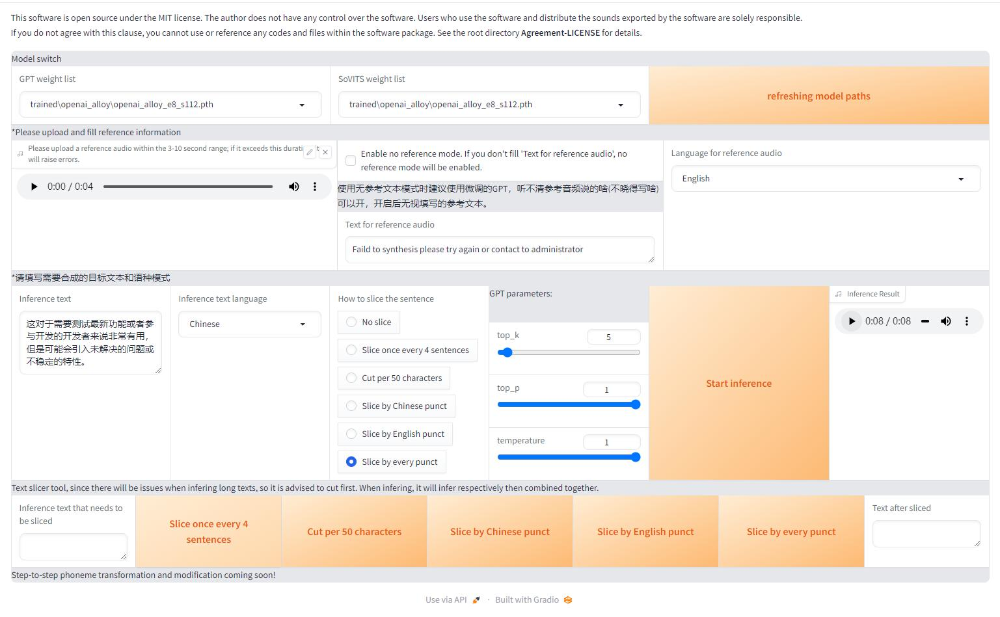

# 推理

## Windows

### 使用cpu推理
本文档介绍如何使用cpu进行推理,使用cpu的推理速度有点慢,但不是很慢

#### 安装依赖
```
# 拉取项目代码
git clone --depth=1 https://github.com/RVC-Boss/GPT-SoVITS
cd GPT-SoVITS

# 安装好 Miniconda 之后，先创建一个虚拟环境：
conda create -n GPTSoVits python=3.9
conda activate GPTSoVits

# 安装依赖：
pip install -r requirements.txt

# (可选)如果网络环境不好，可以考虑换源(比如清华源)：
pip install -i https://pypi.tuna.tsinghua.edu.cn/simple -r requirements.txt
```

#### 添加预训练模型
```
# 安装 huggingface-cli 用于和 huggingface hub 交互
pip install huggingface_hub
# 登录 huggingface-cli
huggingface-cli login

# 下载模型, 由于模型文件较大，可能需要一段时间
# --local-dir-use-symlinks False 用于解决 macOS alias 文件的问题
# 会下载到 GPT_SoVITS/pretrained_models 文件夹下
huggingface-cli download --resume-download lj1995/GPT-SoVITS --local-dir GPT_SoVITS/pretrained_models --local-dir-use-symlinks False
```

#### 添加微调模型(可选)  
笔者是将微调添加到了GPT-SoVITS/trained 内容如下,正常情况下包含 openai_alloy-e15.ckpt 和openai_alloy_e8_s112.pth 即可
```
├── .gitignore
├── openai_alloy
│   ├── infer_config.json
│   ├── openai_alloy-e15.ckpt
│   ├── openai_alloy_e8_s112.pth
│   ├── output-2.txt
│   ├── output-2.wav
```

#### 启动推理webtui
```
python.exe GPT_SoVITS/inference_webui.py
```
配置如下


### 使用gpu推理
请根据你的操作系统选择合适的cuda版本
```
pip uninstall torch torchaudio torchvision -y
pip install torch torchvision torchaudio --index-url https://download.pytorch.org/whl/cu117
```
检查 torch和cuda是否可用
```
>>> import torch
>>> torch.cuda.is_available()
True
```
